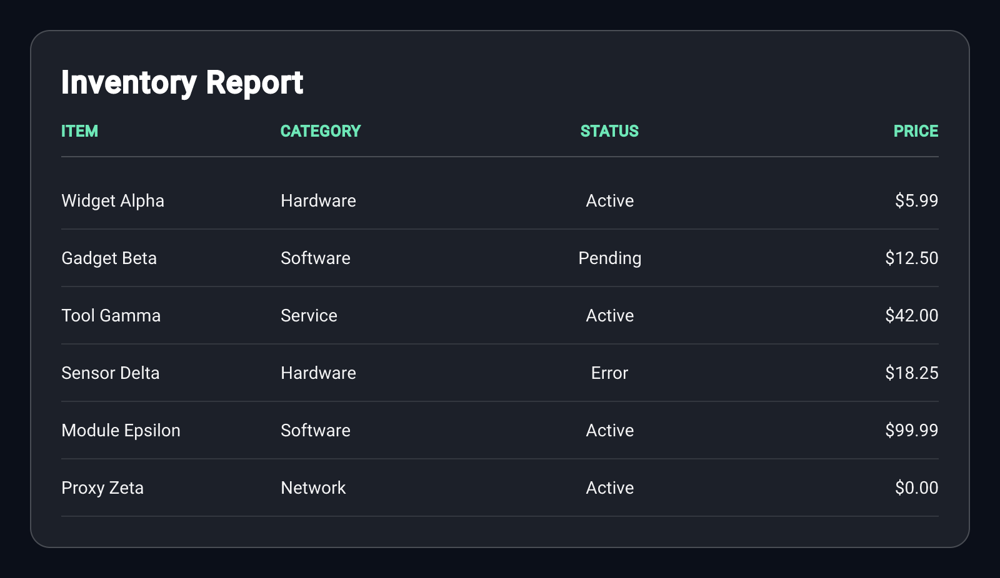
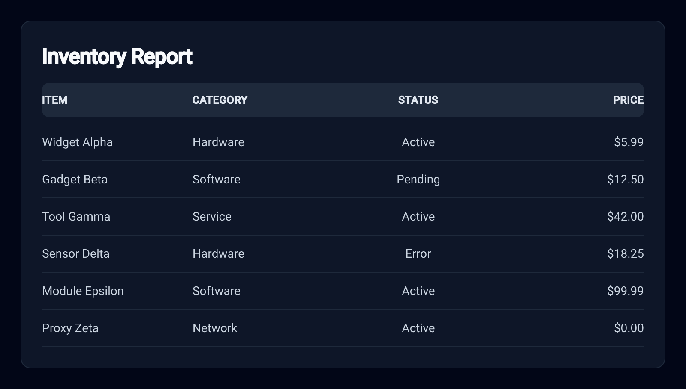
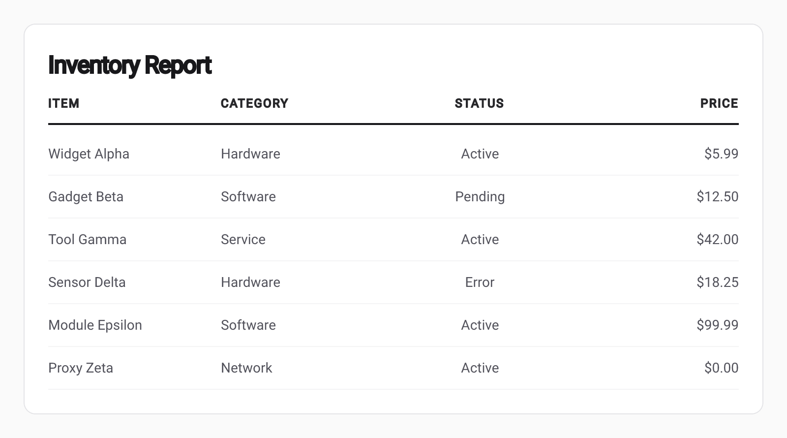
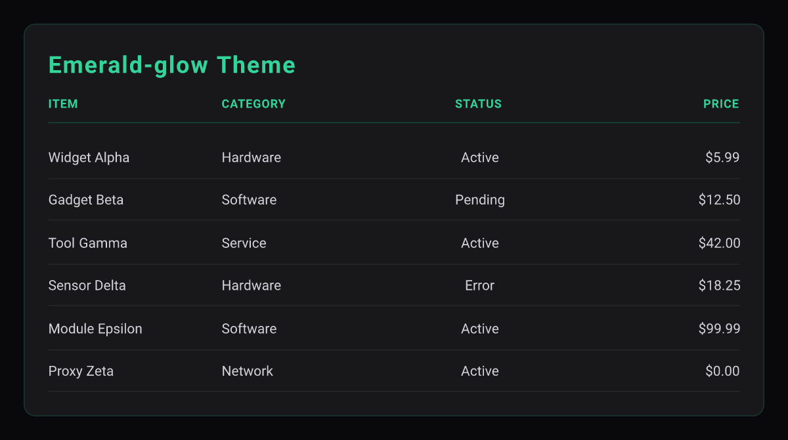
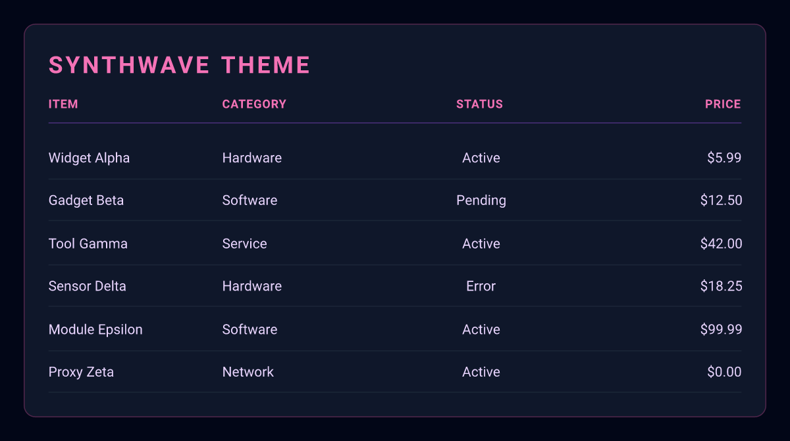

# markdown-table-to-image-mcp

A [FastMCP](https://github.com/punkpeye/fastmcp) server that converts Markdown tables into beautifully styled, high-DPI PNG images. Pipe any Markdown table through a single MCP tool call and get back a publication-ready image card.

## Features

- **5 built-in themes** — glassmorphism, slate-dark, minimalist-light, emerald-glow, synthwave
- **Flexible aspect ratios** — auto (shrinks to content), 16:9, 1:1, 9:16
- **High-DPI output** — configurable scale multiplier for Retina-sharp pixels
- **Transparent card background** — optionally render the card panel without a fill
- **LRU cache** — repeated identical renders return immediately from memory
- **Input safety** — HTML stripping, and bounds on input size, rows, and columns

## Setup

### 1. Clone and build

```bash
git clone https://github.com/kweinmeister/markdown-table-to-image-mcp.git
cd markdown-table-to-image-mcp
npm ci
npm run build
```

### 2. Configure your MCP client

Replace `/absolute/path/to/markdown-table-to-image-mcp` with the actual path on your machine.

#### Claude Code

Edit `~/.claude/settings.json` (user-level) or `.claude/settings.json` (project-level):

```json
{
  "mcpServers": {
    "markdown-table-to-image": {
      "command": "node",
      "args": ["/absolute/path/to/markdown-table-to-image-mcp/dist/server.js"]
    }
  }
}
```

#### Antigravity

Open **Manage MCP Servers → View raw config** and edit `~/.gemini/antigravity/mcp_config.json`:

```json
{
  "mcpServers": {
    "markdown-table-to-image": {
      "command": "node",
      "args": ["/absolute/path/to/markdown-table-to-image-mcp/dist/server.js"]
    }
  }
}
```

## Tool Reference

### `markdown_table_to_image`

Converts a Markdown table string to a styled PNG image card.

| Parameter               | Type    | Default         | Description                                                                                          |
| ----------------------- | ------- | --------------- | ---------------------------------------------------------------------------------------------------- |
| `markdown`              | string  | required        | Raw Markdown table (must include header and separator rows). Max 50,000 chars, 50 columns, 500 rows. |
| `title`                 | string  | —               | Optional title displayed above the table. Max 200 chars.                                             |
| `theme`                 | string  | `glassmorphism` | Visual theme. See [Themes](#themes).                                                                 |
| `aspectRatio`           | string  | `auto`          | Canvas proportions. One of `auto`, `16:9`, `1:1`, `9:16`. `auto` shrinks the canvas to fit the card. |
| `scale`                 | number  | `2`             | High-DPI multiplier (0.5–4). Use `2` for Retina-sharp output.                                        |
| `customWidth`           | integer | `800`           | Canvas width in logical pixels (200–3840).                                                           |
| `transparentBackground` | boolean | `false`         | Renders the card panel without a fill. The canvas retains its theme background.                      |

#### Example prompt

```
Convert this to a synthwave-themed image with a 1:1 canvas:

| Item | Category | Status | Price |
| :--- | :--- | :---: | ---: |
| Widget Alpha | Hardware | Active | $5.99 |
| Gadget Beta | Software | Pending | $12.50 |
| Tool Gamma | Service | Active | $42.00 |
| Sensor Delta | Hardware | Error | $18.25 |
| Module Epsilon | Software | Active | $99.99 |
| Proxy Zeta | Network | Active | $0.00 |
```

## Themes

| Theme              | Description                                              | Preview                                                        |
| ------------------ | -------------------------------------------------------- | -------------------------------------------------------------- |
| `glassmorphism`    | Dark canvas, frosted-glass card with blue-purple accents |        |
| `slate-dark`       | Deep slate background with clean white typography        |              |
| `minimalist-light` | White card on a light grey canvas, high-contrast text    |  |
| `emerald-glow`     | Dark background with emerald green highlights            |          |
| `synthwave`        | Purple and pink neon gradients on a deep dark canvas     |                |

## Development

```bash
npm run dev        # Live reload via tsx watch
npm run lint       # Run Biome linting and formatting check
npm run typecheck  # Run TypeScript compiler (noEmit)
npm test           # Run the Vitest test suite
npm run build      # Compile to dist/ for production
```

## Tech Stack

- [FastMCP](https://github.com/punkpeye/fastmcp) — MCP server framework (stdio transport)
- [Takumi](https://github.com/kane50613/takumi) — Rust-based JSX → PNG renderer
- [Zod](https://github.com/colinhacks/zod) — Runtime schema validation
- [Biome](https://biomejs.dev/) — Linting and formatting
- [Vitest](https://vitest.dev/) — Test runner
